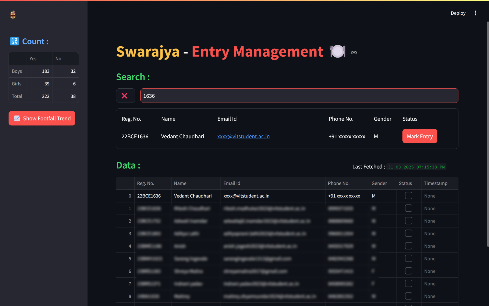
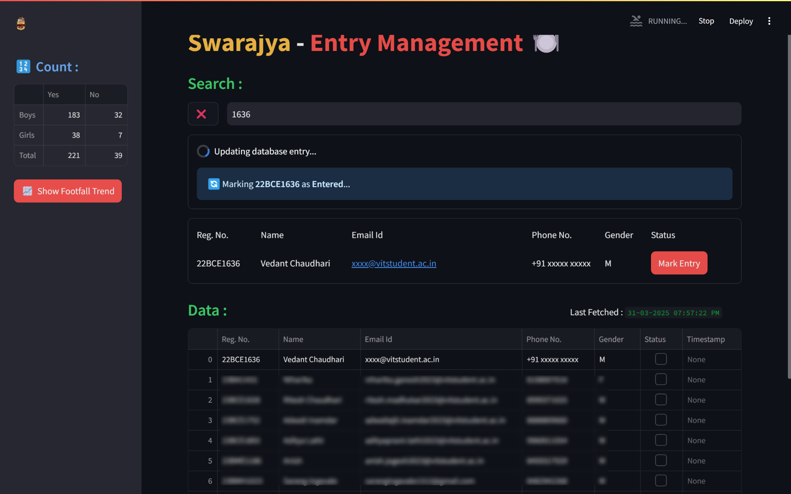
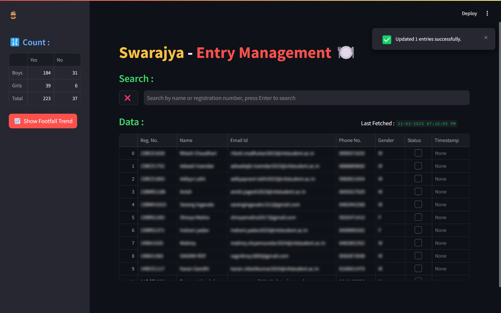
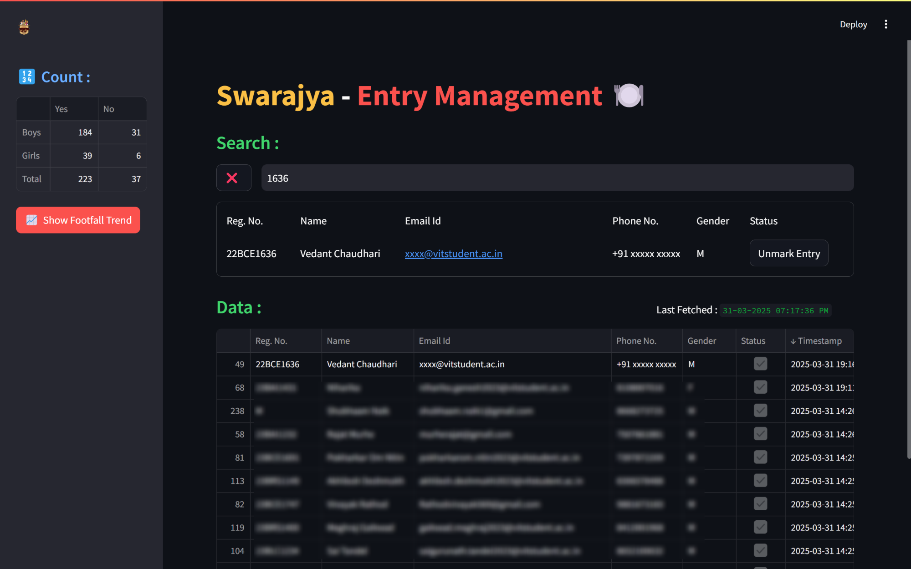
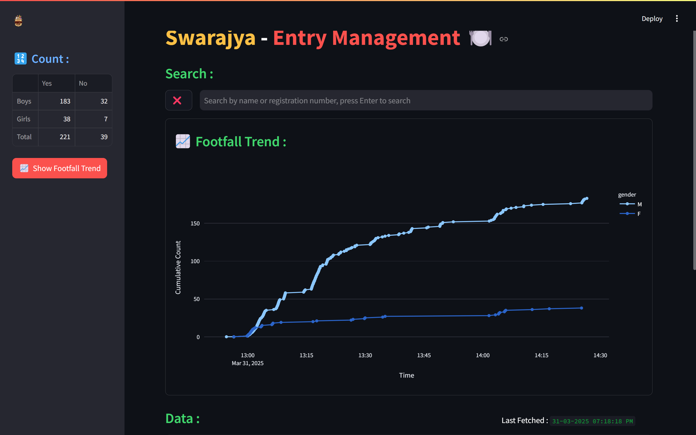

# `Entry Management System`

ℹ️ This repository contains the code for an application designed to streamline and simplify the entry management process with offline verification.


## Table of Contents
- [🎯 Problem Statement](#-problem-statement)
- [🔍 Approach](#-approach)
- [📸 Screenshots](#-screenshots)
- [💻 Tech-Stack](#-tech-stack)
- [⚙️ Installation](#%EF%B8%8F-installation)
- [🤝 Contributions](#-contributions)
- [📜 License](#-license)
- [📬 Contact](#-contact)


## 🎯 Problem Statement
- Paid events at VIT Chennai require efficient entry management.
- This application is specifically built to handle entry verification for a food event conducted by `Swarajya: Marathi Literary Association`.
- Registered attendees receive passes/tokens for entry.
- The management team needs a system to verify passes and mark entries for registered attendees.
- A minimum concurrency of two devices is required to manage parallel queues.
- The system must operate in real-time or near real-time to ensure a smooth entry process.
- The interface should be intuitive and user-friendly for the event management team.


## 🔍 Approach
- Utilizing a **local MySQL server** to store attendee data.
- Developing a **web application with Streamlit** for efficient entry management.
- Providing a **user-friendly UI** with `Mark Entry` and `Unmark Entry` options for verification and error correction.
- Displaying **real-time dashboards** with marked and unmarked entry statistics.
- Incorporating a basic **line chart** for visualizing footfall trends over time, though its analytical depth is limited.


## 📸 Screenshots

### 🔎 Search
- Users can search for registered attendees using their **name or registration number**.
- Matching results are displayed below the search bar.
- 

### ✅ Mark Entry
- Attendees' entries can be marked upon verification.
- The UI ensures users are aware of any incomplete queries or errors.
- 

### 🎉 Success
- A success message is displayed after marking an entry.
- The dashboard also updates instantly to reflect changes.
- 

### 🔄 Unmark Entry
- Users can **undo** an accidental marking.
- 

### 📊 Trend Analysis
- A **footfall trend analysis** graph is displayed for event insights.
- This feature helps visualize entry trends over time.
- While not a core necessity, it provides a visual representation.
- 


## 💻 Tech-Stack
- **Frontend:** Streamlit
- **Database:** MySQL Workbench
- **Visualization:** Plotly Express


## ⚙️ Installation

### 1️⃣ Clone the repository:
```bash
git clone --depth 1 https://github.com/Bbs1412/Swarajya-Food-Entry
cd Swarajya-Food-Entry
```

### 2️⃣ Set up a virtual environment:
```bash
python -m venv env
# Activate on Windows:
.\env\Scripts\activate
# Activate on macOS/Linux:
source env/bin/activate
```

### 3️⃣ Install dependencies:
```bash
pip install -r requirements.txt
```

### 4️⃣ Set up MySQL database:
- Ensure MySQL Workbench is installed and running.

- Following fields are expected from UI application:
    + `reg` : Registration number of the person
    + `name` : Name of the person
    + `email` : Email of the person
    + `phone` : Phone number of the person
    + `gender` : Gender to show the counts.
    + `status` : Entry status of the person (0 or 1)
    + `timestamp` : NULL or current timestamp of marking entry.
    + `search_str` : auto generated string to search for the person in the table (reg + " " + name).

- Create a database and a table with the following schema:
    ```sql
    CREATE TABLE data (
        reg VARCHAR(20) PRIMARY KEY,
        name VARCHAR(100) NOT NULL,
        email VARCHAR(100) NOT NULL,
        phone VARCHAR(15) NOT NULL,
        gender ENUM('M', 'F') NOT NULL,
        status BOOLEAN DEFAULT FALSE,
        timestamp DATETIME NULL,
        search_str TEXT GENERATED ALWAYS AS (CONCAT_WS(' ', reg, name)) STORED
    );
    ```

- Inserting entries: 
> [!NOTE]  
> Leaving it up to you to find the best way to insert the entries in the table from whatever form of data you have.

- Update or delete operations:
> [!TIP]
> By default workbench uses **Safe Update Mode**. Use primary key in all delete and update queries or disable the safe update mode.

### 5️⃣ Configure environment variables:
- Create a `.env` file in the root directory and add the following:
    ```ini
    DB_HOST = "localhost"
    DB_USER = "user_name"
    DB_PASSWORD = "password"
    DB_NAME = "database_name"
    ```

### 6️⃣ Run the application:
```bash
streamlit run app.py
```

### 7️⃣ Access the application from other devices:
- Connect all devices to the **same network**.
- Retrieve the **IP address** of the host device using `ipconfig` (Windows) or `ifconfig` (Linux/macOS).
- Open the web app in a browser using `<ip_address>:<port_number>`.
- e.g. `http://192.168.1.100:8501`


## 🤝 Contributions
- Contributions to this repo are always welcome!
- Feel free to use this project for **your own events** and share feedback 😇.


## 📜 License
[](https://www.gnu.org/licenses/gpl-3.0)


## 📬 Contact
- **Email** - [bhushanbsongire@gmail.com](bhushanbsongire@gmail.com)
- **LinkedIn** - [Bhushan Songire](https://www.linkedin.com/in/bhushan-songire/)
